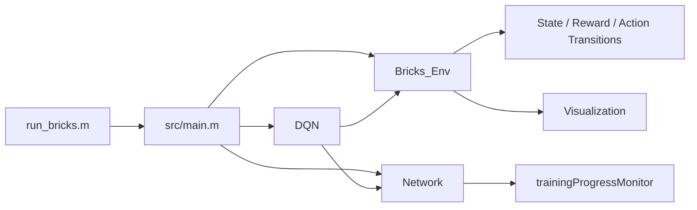

# Bricks DQN

## Description

Bricks is a MATLAB reinforcement-learning project that trains a Deep Q-Network (DQN) agent on a custom brick-stacking environment.

The environment represents a vertical playfield where bricks of different lengths arrive at the top, move downward, and can be shifted horizontally. The agent learns which move to choose so that it clears rows, avoids illegal moves, and survives as long as possible.


## Demo


## Features

- Custom MATLAB environment implemented in [`src/Bricks_Env.m`](src/Bricks_Env.m)
- DQN training loop with replay buffer and target network in [`src/DQN.m`](src/DQN.m)
- `dlnetwork`-based Q-network defined in [`src/Network.m`](src/Network.m)
- Training progress monitoring with MATLAB's training monitor
- Episode simulation and visualization

## Repository Layout

```text
.
|-- run_bricks.m
|-- LICENSE
|-- README.md
|-- src/
|   |-- Bricks_Env.m
|   |-- Calc_grad.m
|   |-- DQN.m
|   |-- Network.m
|   |-- clip.m
|   |-- huberLoss.m
|   |-- main.m
|   |-- select.m
|   `-- data.mat		# pre-trained network
|-- videos/				# all simulations automatically will save here.
`-- Backup/				# created automatically for checkpoints
```

## Architecture



## Requirements

- MATLAB with Deep Learning Toolbox
- Support for `dlnetwork`, `dlarray`, `dlfeval`, and `trainingProgressMonitor`

## How It Works

1. `src/main.m` configures the environment, network sizes, and training hyperparameters.
2. `src/Bricks_Env.m` generates states, legal actions, rewards, and episode transitions. and also provides simulation and visualization helpers for watching the learned policy.
3. `src/DQN.m` fills the replay buffer, samples minibatches, trains the online network, and periodically syncs the target network.
4. `src/Network.m` builds the neural network and wraps forward, training, and monitoring utilities.


## Guide

## Running

From the repository root, run:

```matlab
run("run_bricks.m")
```

You can also call the training script directly:

```matlab
run("src/main.m")
```

The script will:

- initialize the environment and networks
- automatically resume from `data.mat` if it exists
- train the DQN agent
- save checkpoints to `Backup/`
- save the final training state to `data.mat`
- plot the training and validation returns
- run a short simulation with the trained policy

## Outputs

- `data.mat` stores the latest training state
- `Backup/data_back_*.mat` stores periodic checkpoints
- `videos/` stores the simulaition animation

## Notes

- The code uses the repository root as the artifact location.
- The environment visualization is interactive and may be slow depending on the chosen `frame_len` and `frame_dur`.
- If you want a fresh run, delete `data.mat` and the `Backup/` folder before launching training.
